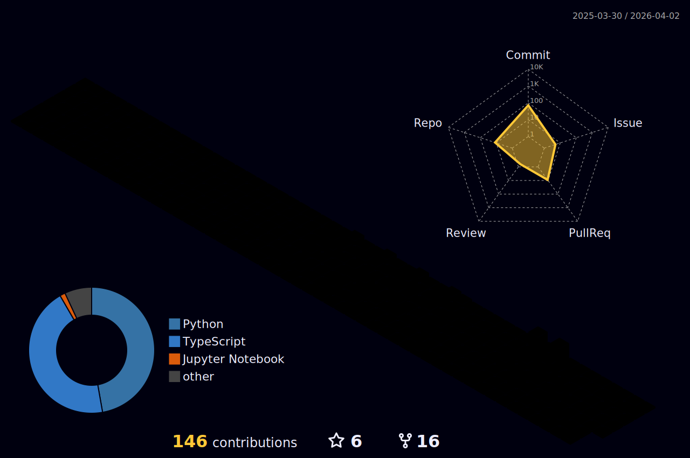

<!-- Animated Header -->

  

 

  

### 👾 about

- 💻 I build **full-stack & mobile apps**, ship **AI systems**, and work across **cloud & infrastructure**
- 🤖 Passionate about **Machine Learning, NLP, and Deep Learning**
- 🌱 Currently exploring **Golang** and contributing to **Open Source**
- 🔍 **Actively seeking Summer 2026 internships** — let's connect!
- 📫 Reach me at **dalvimanas33@gmail.com**

---

### 🔗 links

  
  
  
  
  

---

<!--  ### 🧬 stack

**📱 Mobile & Frontend**

**🤖 AI / ML**

**⚙️ Backend, Cloud & Databases**

**🔧 Languages & Tools**

---
 -->

### 📡 stats

  
  

  

---

### 🌊 contributions

  

---

### 💡 today's quote

  

